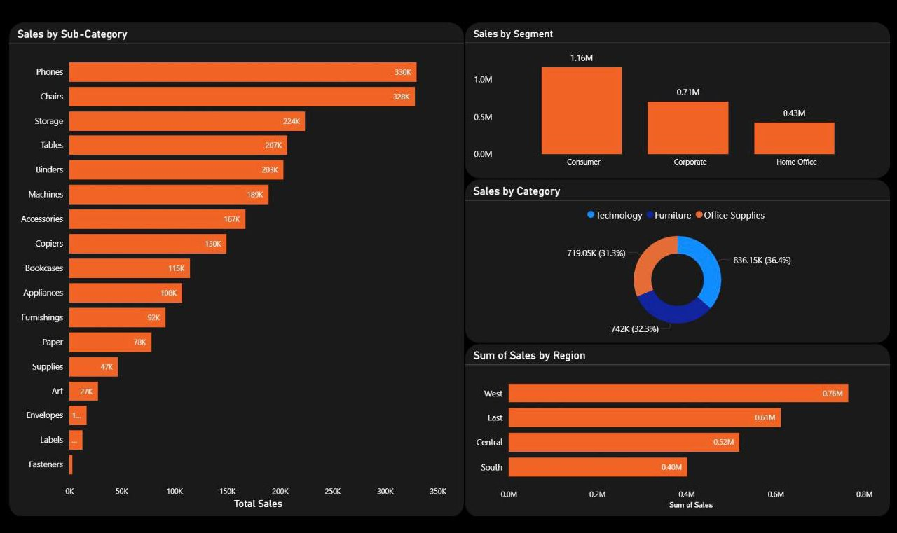
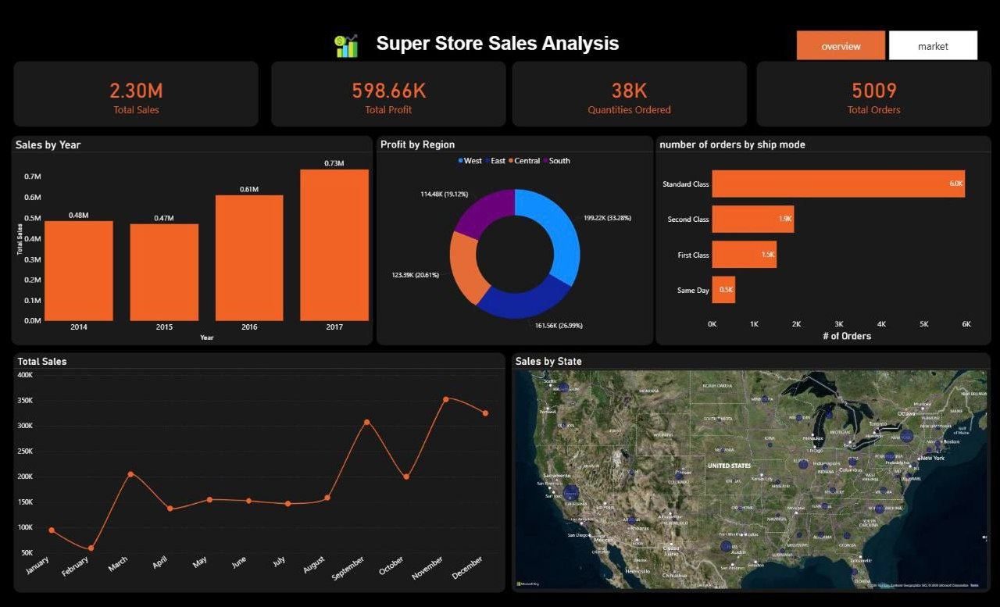

📊 Sales Performance Dashboard

Advanced Data Modeling • Power Query (M) • DAX • Business Intelligence

🔎 Project Overview

This project presents an end-to-end Business Intelligence solution built using Power BI, transforming raw retail transactional data into a structured Star Schema data model and delivering actionable executive insights through an interactive dashboard.

The objective was to:

Establish a scalable analytical data model

Implement robust data cleaning and transformation logic

Develop reusable DAX measures for KPI reporting

Deliver performance insights across regions, products, and time

The solution follows enterprise BI best practices including modular ETL design, surrogate key modeling, and time intelligence implementation.

🛠 Tools & Technologies

BI Platform

Power BI Desktop

Languages

Power Query (M)

DAX (Data Analysis Expressions)

Data Format

CSV (Retail Transactional Dataset)

Concepts & Architecture

Star Schema Modeling

Fact & Dimension Tables

Surrogate Keys

Time Intelligence

KPI Development

Data Quality Handling

Modular ETL Design

🏗 Data Architecture

The project implements a structured Star Schema to optimize performance and scalability.

⭐ Fact Table — FactSales

Contains transactional metrics:

Sales

Profit

Quantity

Discount

Order & Ship Dates

Foreign Keys to dimensions

🔹 Dimension Tables

DimCustomer – Customer segmentation analysis

DimProduct – Category and sub-category performance

DimShipMode – Shipping performance evaluation

DimDate – Time intelligence (Year, Quarter, Month, YoY trends)

This modeling approach improves:

Query performance

Report maintainability

Analytical flexibility

Scalability for larger datasets

🧹 Data Cleaning & Transformation (Power Query)

The ETL process was designed using modular and reusable M functions.

Implemented Data Quality Controls:

Enforced strict data type validation

Removed full-row duplicates

Trimmed and standardized text fields

Parsed dates using explicit locale settings

Automated postal code imputation using:

(City, State) → Mode Postal Code mapping

Replaced descriptive fields with surrogate keys in the fact table

The solution separates:

Staging layer

Dimension layer

Fact layer

This layered design mirrors enterprise BI pipelines.

📈 KPI Framework & Advanced DAX

A structured DAX measure library was created including:

Core KPIs

Total Sales

Net Profit

Normalized Profit

Profit Margin

Total Orders

Total Customers

Average Order Value

Time Intelligence

MTD / QTD / YTD calculations

Year-over-Year growth

YoY %

Previous Year comparisons

Analytical Measures

Top-performing region

Top-performing sub-category

Profitability classification logic

All measures are reusable and scalable for multi-page dashboards.

📊 Key Business Insights

💰 $2.3M Total Sales

💵 $598K Profit (~26% margin)

📈 Strong revenue growth from 2016 → 2017

🌎 West region leads in both sales and profitability

🪑 Phones & Chairs are top-performing categories

📆 Q4 (especially November) drives peak revenue

📸 Dashboard Preview

